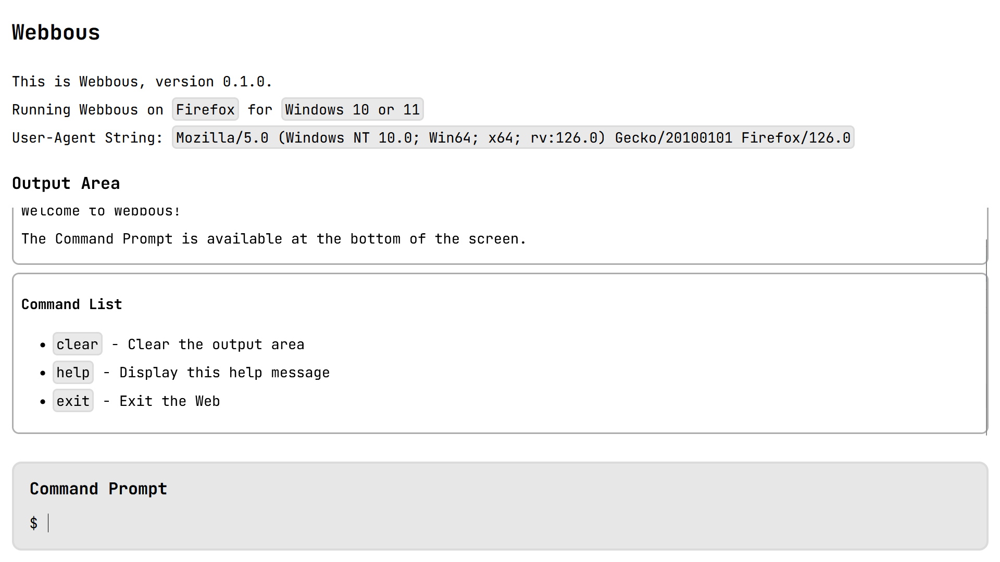

# Webbous

Webbous is a modular web-based command-prompt-centred environment written using
the React framework.

## Using Webbous

[Try Webbous online.](https://aeriavelocity.github.io/webbous/)

To run Webbous on your own system, first `git clone https://github.com/aeriavelocity/webbous.git`,
then `cd webbous` and `npm run start` to run Webbous locally.

## Developing for Webbous

Webbous leverages React as its development framework, which allows for great
moddability and modularity. You need only create a JSX file with your
functionality and hook it up to `handleCommandSubmit()` in `src/CommandProcessor.jsx`.

In theory, it should work with most React and JSX stuff, but that remains to be
tested.

## Contributing

If you're experienced with React and modularity in web apps, feel free to get in
touch. I appreciate any and all help.

## Licence

Webbous is licensed under the GNU General Public License v3.0. You can use
Webbous however you please, but you cannot change the licence, nor can you take
Webbous or its components and proprietarise them.

(Proprietarise isn't a word, but you know what I mean.)
